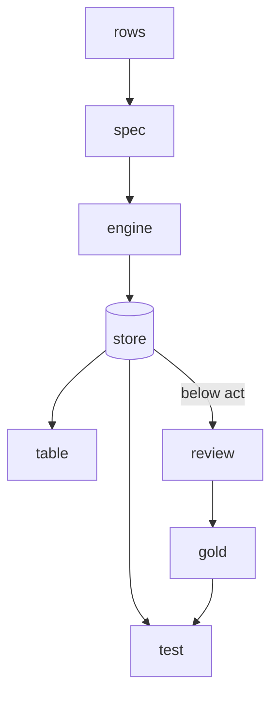

## Rows

hunch works on rows: one ticket, one agent turn, one product review. A row comes from a CSV file, from agent session logs (`traces(...)`), or from a Python function that returns dicts (`py(file.py:fn)`). Each row has an id (the `key` column).

## Spec and judgment

A **spec** is a YAML file that describes one **judgment**: the questions to ask, which columns of the row the model may see (`state`), and how to test the answers. Specs live in git next to your code. A folder of specs is a **project**; one judgment can read another's results, so a project is a small graph, like dbt models.

## Questions

A judgment asks one or more questions of every row. Jev reads all of a row's questions in one request; an LLM engine gets one request per question. There are four types:

| Type | Answer | Example |
|---|---|---|
| `choice` | one option from a list, with a probability for each | which team handles this ticket |
| `noul` | yes or no, with the probability of yes | is the customer's business blocked |
| `score` | a level on a described scale | how frustrated, from calm to very angry |
| `multi` | yes or no for each option (becomes one `noul` per option) | which topics does the review mention |

The model reads the question's `instructions` and `criteria` and the row's `state`, not the question's name: Jev's API uses the name only as an identifier, and the LLM prompt leaves it out. The instructions carry the whole meaning. The name is not part of the cache key, so renaming a question asks nothing.

## Answers and the store

An **answer** is the engine's typed output: a label and probabilities, never free text. Every answer is stored in `.hunch/store.sqlite` under a key made from the exact request: the model, the state and the question as sent. The same request is never paid for twice. Change one question and only that question is asked again; change nothing and a re-run costs $0. Settings that are not sent (`act`, `gold`) are not part of the key, so tuning them is free.

After a run, each judgment's results are written to a **table** in the store: the row's columns, each answer and its probability, and which run produced it.

## Gold

**Gold** is the answer you trust for a row. It comes from an answer-key column in your data (`gold:`) or from a person's **review**. With gold, `test` measures accuracy; without it, `test` estimates accuracy from random reviewed rows and says how sure it is.

## act

`act` is the confidence below which an answer should not be acted on automatically. Rows below it go to the review queue. It is a routing threshold, not part of the question, so changing it re-asks nothing. `test` prints a **dial**: for each threshold, how many rows would be automated and how many of those would be wrong.

## Review

`hunch review` shows rows to a person and records a verdict. The queue puts first the rows that matter most: where the model disagrees with the answer key, then a random sample of the rest (spot checks, which make the accuracy estimate honest), then rows below `act`. A verdict is tied to the exact text of the row, so if the input changes, the old verdict no longer counts. Judge only from what the screen shows; if you can only decide because you know more than the row shows, mark it as needing more context. That measures a gap in the input, not a model error.

## Engine

The **engine** answers questions. The recipes and examples use TypeSafe's Jev, a small model built for typed judgments with probabilities; every spec names its engine in `model`. Any LLM that returns token probabilities works too (`--model deepseek:...`, `--model openrouter:...`); hunch reads the probability of each option from the first answer token. Answers from different engines are stored separately, so you can compare them row by row. See [Engines](/guides/engines).

## How it fits together

1. Write a spec for a judgment you make today by hand or with an ad hoc prompt.
2. `hunch compile` to see the exact request and cost, `hunch run` to answer every row.
3. `hunch review` a sample, so there is gold; `hunch test` to measure.
4. Change the spec, `hunch diff` to see what flips, keep the change if it wins.
5. Call the same spec from your app with `hunch.judge(...)`; the answers it logs can be replayed against the next version of the spec.
