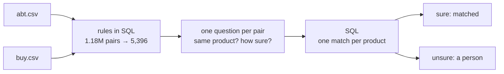

One shop sells a `Sony Turntable - PSLX350H`. Another sells a `Sony PS-LX350H Belt-Drive Turntable`. Same record player.

The same two shops sell a `Sony Cyber-Shot Black Digital Camera - DSCT500B` and a `Sony Cyber-shot DSC-T300 Digital Camera - Black`. One digit apart, and two different cameras.

How would your code tell those two cases apart?

## What you'll build

Joining two lists of the same things is an old problem: products after an acquisition, suppliers in two systems, customers who signed up twice. This cookbook solves it for two real catalogues, about a thousand products each, as three steps of code:



Of the 980 matches it makes, 971 are right. The 682 it is sure of are all right.

## Start with rules

Most matching code starts where you would: compare the model codes. `PSLX350H` and `PS-LX350H` agree once the hyphen is ignored. When no code agrees, count the words the two names share.

Rules are a sieve. Comparing every product in one shop with every product in the other is 1.18 million pairs, almost all of them absurd. `candidates.py` keeps, for each product, the five most likely partners: 5,396 pairs, and 97 of every 100 true matches are among them.

A sieve can't choose, though. Taking each product's best candidate by the rules gets 955 of 1,081 right, and its mistakes look like this:

```text
Garmin 010-10723-02 Carrying Case    →  rules pick:  Garmin USB Cable - 010-10723-01
                                         the match:   Garmin Leather GPS Case
```

The codes differ by one digit, so the rules pick a cable for a case. Telling a case from a cable is not a matter of characters. It is a judgment.

## Ask one question about each pair

hunch asks that judgment as a question, written once in a spec. The spec says where the pairs come from, what the model may read, and what to ask:

```yaml same_product.yml
judgment: same_product
model: jev-1.13.0
source: py(candidates.py:pairs)
key: id
state: [abt_name, abt_description, abt_price, buy_name, buy_manufacturer, buy_description, buy_price]
questions:
  same:
    type: noul          # a yes-or-no question
    instructions: >-
      Two shops list a product: `abt_name` (with `abt_description` and `abt_price`) and `buy_name` (with
      `buy_manufacturer`, `buy_description` and `buy_price`). Are they the same product: the same maker and the same
      model? A different model number, size or capacity is a different product, and so is an accessory made for it.
      The two shops word names differently, and a price may be missing. A shop may also add its own letters to the
      end of the same model's code (AB123 in one shop, AB123XY in the other): when the rest of the code and the
      product agree, it is the same product. But when both listings name a colour and the colours differ, they are
      different products.
    gold: gold_same     # the known answer, for testing
    act: 0.9
```

Every answer comes back with how sure it is. For the turntable's candidates:

| Candidate | Same product? | How sure |
| --- | --- | --- |
| Sony PS-LX350H Belt-Drive Turntable | yes | 0.95 |
| Sony PSLX300USB USB Record Turntable | no | 0.98 |
| Sony Print Paper - SVMF40P | no | 0.99 |

The second row is the one a rule would struggle with: the same maker, a similar code, the same kind of product, and a different model. For the Garmin case, the leather case gets "yes" at 0.92 and the USB cable doesn't. All 5,396 pairs take about 90 seconds and cost $0.14.

## Act only when it is sure

That number next to each answer is what makes a decision safe to automate. `act: 0.9` in the spec is the bar: an answer at 0.9 or above is acted on, anything below goes to a person. Think of it as a colleague who signs off on what they are sure of and leaves the rest in your inbox.

Here, 4,797 of the 5,396 pairs clear the bar, about nine in ten. The other 599 wait for a person.

## Turn answers into matches, in SQL

A yes on each pair is not yet a list of matches: a product can have two candidates that both look right. The last step belongs where the data is. `hunch.sql` makes the spec a function DuckDB can call, so the decision becomes a column, and a query keeps the likeliest pair for each product on both sides:

```sql
select * from (select * from decided where label = 'yes'
               qualify row_number() over (partition by abt_id order by p_yes desc, rank::int, buy_id) = 1)
qualify row_number() over (partition by buy_id order by p_yes desc, rank::int, abt_id) = 1;
```

That is the whole job as code: a rule, a question, a query. Each piece lives in a file, runs again for free from the cache, and can be tested on its own.

## Does it work

Scored against the benchmark's own list of true matches:

| | Matches made | Right |
| --- | --- | --- |
| Rules alone | 1,081 | 955 |
| Rules, then the question | 980 | 971 |
| Only the ones it is sure of | 682 | 682 |

The question's gain is in the mistakes: 9 wrong matches instead of 126.

## A clearer instruction made it worse

The spec above is its third version, and the second one is the most useful thing in this cookbook.

The first version said nothing about shops adding their own letters to a code, so the model called `PM1327BK` and `PM1327` different products. The obvious fix was one more sentence: shops add letters "for a colour, a finish or a region", and then it is the same product. It read clearly. It was clearly right.

Before shipping it, `hunch diff` asked the new wording of every pair and compared the answers with the old one's:

```text
same: 68/5396 rows flip (40 within noise band)
  gold accuracy on the 5286 shared rows with gold 98.6% → 98.3%  (✓ 23 fixed, ✗ 40 broken, 0 wrong both times, 5 without gold)
```

It fixed 23 pairs and broke 40. The broken ones were cameras: a silver and a gold Cyber-shot DSC-W150 are two products, and "a colour" in the new sentence told the model they were one. A reader would have approved that edit. `diff` is what caught it, the way a test suite catches a change that looks harmless.

The third version keeps the letters and draws the line at colours both listings name. `diff` again: 35 fixed, 4 broken. That wording shipped.

This is the habit the cookbook is really about. The words in a spec are code: an edit can break things far from where you made it, so you check the edit on every row before it ships.

## Use it on your data

```sh
uv run --extra sql python prototype/examples/product_matching/match.py    # about $0.14 the first time, then free
```

For your own lists, point the three `read_csv` lines in `candidates.py` at your files and change the columns. Keep the question. Then [review](/guides/review) a few dozen of your own pairs, and `hunch test` tells you how often it is right on your products rather than these.

## How it was measured

<AccordionGroup>
  <Accordion title="The data">
    [Abt-Buy](https://dbs.uni-leipzig.de/research/projects/benchmark-datasets-for-entity-resolution), a benchmark from the University of Leipzig (Creative Commons): 1,081 products from Abt, 1,092 from Buy, 1,097 known matches. The rules in `candidates.py` keep 1,061 of the 1,097 among their 5,396 pairs; the 36 lost share a few words with their match, but five other listings outrank them. For 51 products the rules' two best candidates tie, and the lower id wins. Since 16 products have more than one true match, one match per product can reach at most 1,044 (95.2%).
  </Accordion>
  <Accordion title="The answer key was checked, and it was mostly right">
    The first wording disagreed with the benchmark's answer key on 180 pairs, and its most confident disagreements looked like the key's mistakes (a 500GB drive matched to a 1TB one). A blind panel of three AI reviewers (one Claude Opus, two Claude Sonnet, one reading in reverse order) judged those 180 and a random 100, seeing what the model saw and neither the model's answer nor the key's. On the 180, the key was right 69 times and the model 22; 81 could not be decided from the listings and on 8 the reviewers split. On the random 100 the panel agreed with both on 96. The reviewers' prompt, in `prototype/review_panel/product_matching/PROMPT.md`, told them a trailing colour or region suffix can be formatting, a hint the first wording lacked. Two later rounds covered the new wordings' fresh disagreements (11 pairs, then 4).
  </Accordion>
  <Accordion title="Accuracy, with its interval">
    With the key corrected by the panel, `hunch test` estimates the question is right on 99.2% of pairs (95% CI 95.4–99.2%), from 100 random reviews and every disagreement. Of the 4,797 pairs above the bar, 2 are wrong against that gold, both a confident "no" for the same product under a shop's own code (a Maytag microwave, a Sanus wall mount); against the uncorrected key 15 are, and the panel judged 12 of those the key's mistake. The matches table is scored against the uncorrected key, as entity-resolution results usually are.
  </Accordion>
  <Accordion title="The wording was chosen on the pairs it is scored on">
    The code-suffix pattern was found in the panel's verdicts, and each version was judged by `diff` against the same gold, so the final numbers are somewhat optimistic for listings like these that it hasn't seen. The first and second versions are kept as `first/same_product.yml` and `tried/same_product.yml`, so both diffs can be run again for free.
  </Accordion>
  <Accordion title="What did not work">
    A small local model trained with [`hunch distill`](/guides/distill), which would make matching free, separated matches from non-matches barely better than a coin (AUROC 0.576, where the question scores 1.000): it reads both listings as one text and loses whether `EX85` and `EX81` are the same code. And the panel is not people: on the hard pairs one reviewer said "same" on 60 pairs the other two called undecidable. For your own catalogues, a person reviewing the pairs below the bar is the better answer key.
  </Accordion>
</AccordionGroup>
