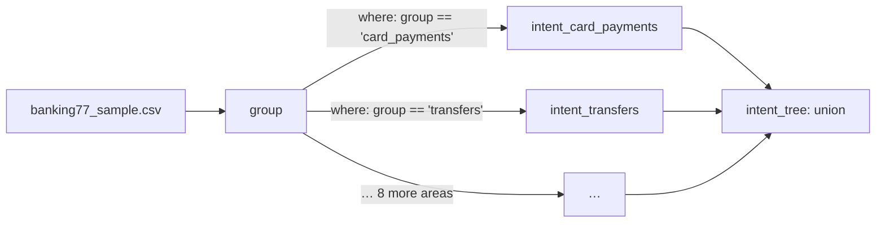

A folder of specs is a **project**. Like models in dbt, a spec can read another spec's output with `ref(...)`, and hunch works out the order to run them in. Every command takes a folder as well as a single file.

Use a project when one judgment only makes sense for some rows ("check the fix only where the agent claims one"), or when a hard question is easier as a sequence of smaller ones ("which area is this about?", then "which intent within that area?").

## The worked example: a two-step classifier

`prototype/examples/banking77_tree/` classifies bank customer messages into 77 intents in two steps: first one of 10 areas, then an intent within that area, asked only of the rows routed there.



The folder holds 12 specs (generated by `build.py`, committed as YAML).

<Steps>
  <Step title="A root judgment reads the file">
    `group.yml` reads the CSV and asks one question, `group`, with 10 options:

    ```yaml group.yml
    judgment: group
    model: jev-1.13.0
    source: ../banking77/banking77_sample.csv
    key: id
    state: [text]
    questions:
      group:
        type: choice
        instructions: Which area of banking is this customer asking about?
        criteria:
          card_setup: Getting, activating, replacing, linking or choosing a card, and the card's PIN
          card_payments: 'Paying with a card in shops or online: declined, pending, reversed, fees, …'
          # … 8 more areas
        gold: gold_group
    ```
  </Step>
  <Step title="Specialists read the root's answers">
    Each area has a spec whose source is `ref(group)`. Its rows are `group`'s output rows: every input column plus `group`'s answer columns (`group`, `group_p`, …). `where` keeps only the rows routed to this area; nothing is asked about the others.

    ```yaml intent_card_payments.yml
    judgment: intent_card_payments
    model: jev-1.13.0
    source: ref(group)
    where: group == 'card_payments'
    chain: true
    reviews: ../banking77/intent.reviews.csv
    state: [text]
    questions:
      intent:
        type: choice
        instructions: What is this bank customer asking about?
        criteria:
          declined_card_payment: A card payment in a shop or online was declined
          pending_card_payment: A card payment is showing as pending
          # … the other card-payment intents
        act: 0.9
        gold: gold_intent
    ```

    A spec that reads `ref(...)` inherits the upstream `key`, so it needs no `key` of its own.
  </Step>
  <Step title="A union puts the pieces back together">
    `intent_tree.yml` collects the `intent` answers from all 10 specialists into one table, so the tree can be tested (and diffed) as one 77-way classifier:

    ```yaml intent_tree.yml
    judgment: intent_tree
    union: [intent_card_setup, intent_card_payments, intent_cash_atm, intent_top_ups, intent_transfers,
            intent_statement_refunds, intent_exchange, intent_security_identity, intent_account, intent_virtual_cards]
    question: intent
    reviews: ../banking77/intent.reviews.csv
    tests:
      intent:
        min_accuracy: 0.85
    ```

    Every branch must ask `intent` with the same type, and a row may reach only one branch. Union rows get a `_branch` column naming the specialist that answered.
  </Step>
</Steps>

## How rows and answers flow

- **Order.** hunch runs judgments in dependency order, whatever the file names. A cycle is an error that names the loop (`cycle: a → b → a`), and so is a `ref(...)` to a judgment that does not exist.
- **Columns.** A downstream spec sees its upstream's input columns and answer columns (see [Columns a judgment adds](/reference/spec#columns-a-judgment-adds)), so both `where` and `state` can use them. `lint` follows the columns through the graph and reports one that does not reach a spec before anything runs.
- **`where` and `chain`.** Without `chain`, `where` is a filter: it decides whether to ask, and confidence is the judgment's own. With `chain: true`, the judgment is a refinement: its answer can only be right if the row was routed to it correctly, so its confidence is multiplied by the probability that the `where` condition holds, computed from the upstream answer's full distribution (`_path_p`). In this example chained confidence separated right from wrong answers better than the specialists' own confidence (AUROC 0.897 vs 0.796).
- **Reviews.** The specialists and the union all point `reviews:` at the flat spec's file, because they ask the same question about the same rows. A verdict you give once counts for every spec that asks it.

## Cost before you run: `compile`

`compile` shows what a run would ask and cost, per judgment, without asking anything. For a downstream judgment it has a problem: how many rows pass `where` depends on answers that may not exist yet.

When none of the upstream answers are cached, it can only give an upper bound: every row might pass. Here, from the repo root, before anything was run:

```bash
uv run prototype/hunch.py compile prototype/examples/banking77_tree --max-cost 0
```

```
# group: 770 rows in; 770 answers planned, 0 cached, 770 to ask, ~485,766 input tokens, ~$0.02040 (jev-1.13.0)
# intent_account: 770 rows in, where keeps ≤ 770; 770 answers planned, 0 cached, ≤ 770 to ask, ~301,543 input tokens, ~$0.01266 (jev-1.13.0)
#   770 rows kept because the answers their where-clause needs aren't cached yet: an upper bound; `hunch run --node group` first for the real count
…
# intent_tree: union of intent_card_setup, intent_card_payments, … (7700 rows)
# total: ~$0.17236
```

When some upstream answers are cached, it uses their pass rate to estimate the rest. The `agent_eval` recipe as set up in `prototype/recipes/agent_eval/` (`claims`, then `fix_correct` and `verified` only where the agent claims a fix; SWE-agent rows, with `weights`) with 200 runs already answered and 40 new ones:

```
# claims: 240 rows in; 240 answers planned, 200 cached, 40 to ask, ~30,036 input tokens, ~$0.00126 (jev-1.13.0)
# fix_correct: 240 rows in, where keeps ≤ 189; 189 answers planned, 149 cached, ≤ 40 to ask, ~54,905 input tokens, ~$0.00231 (jev-1.13.0)
#   40 rows kept because the answers their where-clause needs aren't cached yet: expected ~179 rows, ~$0.00172 (from the 74% pass rate of rows already answered)
# verified: 240 rows in, where keeps ≤ 189; 189 answers planned, 149 cached, ≤ 40 to ask, ~27,816 input tokens, ~$0.00117 (jev-1.13.0)
#   40 rows kept because the answers their where-clause needs aren't cached yet: expected ~179 rows, ~$0.00087 (from the 74% pass rate of rows already answered)
# total: ~$0.00474 upper bound, ~$0.00385 expected
```

`--max-cost` (or `HUNCH_MAX_COST`) is checked against each judgment's estimate before it asks: a judgment whose questions would cost more than that asks nothing.

## Working with one judgment: `--node`

Commands on a folder cover every judgment in it. `--node <judgment>` narrows `run` to that judgment and the judgments it reads from (like dbt's `+model`), `test` to one judgment and `diff` to one pair (pairs are otherwise matched by name); in `compile` it picks which judgment's sample request is printed. `review` works on one judgment at a time, so it needs `--node` in a folder with several:

```
this project has several judgments; pick one with --node (claims, fix_correct, verified)
```

`test` on a folder prints one section per judgment:

```
══ claims (200 rows in)
══ fix_correct (200 rows in, where kept 149 of 200)
  gold: 149 rows (149 from source, 0 from review)
  PASS accuracy 67.9% [weighted to the population] (min 0%)
  PASS calibration error 0.173 [weighted to the population] (max 1)
  PASS AUROC 0.758 (92 yes / 57 no; 0.5 = coin toss; unaffected by base rate) (min 0.7)
══ verified (200 rows in, where kept 149 of 200)
```

## Is the tree better than one flat question?

That is what projects make easy to measure. On the 385-message holdout, the tree was **worse** than the flat 77-way spec: 87.5% vs 95.8% estimated accuracy (fixed 3 answers, broke 35, p < 0.001), though 48% cheaper. The main loss is routing: 33 messages were sent to an area that did not contain their intent, so no specialist answer could be right. `test` reports this directly ("rows' gold is not among the options this judgment offered"). See [Change a spec safely](/guides/change-a-spec) for how `diff` compares two versions on the same rows.
