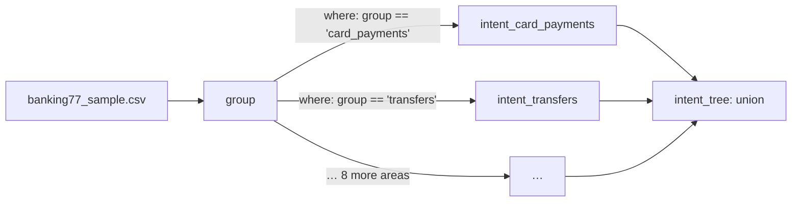

A folder of specs is a project. A spec can read another spec's output with `ref(...)`, and hunch runs them in dependency order, like models in dbt. Every command takes a folder as well as a single file.

A project fits when a question only makes sense for some rows ("check the fix only where the agent claims one"), or when a hard question is easier as a sequence of smaller ones ("which area?", then "which intent within that area?").

## Example: a two-step classifier

`prototype/examples/banking77_tree/` classifies bank messages into 77 intents in two steps: one of 10 areas first, then an intent within that area, asked only of the rows routed there. The 12 specs are generated by `build.py` and committed as YAML.



The root reads the file:

```yaml group.yml
judgment: group
model: jev-1.13.0
source: ../banking77/banking77_sample.csv
key: id
state: [text]
questions:
  group:
    type: choice
    instructions: Which area of banking is this customer asking about?
    criteria:
      card_setup: Getting, activating, replacing, linking or choosing a card, and the card's PIN
      card_payments: 'Paying with a card in shops or online: declined, pending, reversed, fees, …'
      # … 8 more areas
    gold: gold_group
```

Each specialist reads the root's answers and keeps only its own rows:

```yaml intent_card_payments.yml
judgment: intent_card_payments
model: jev-1.13.0
source: ref(group)
where: group == 'card_payments'
chain: true
reviews: ../banking77/intent.reviews.csv
state: [text]
questions:
  intent:
    type: choice
    instructions: What is this bank customer asking about?
    criteria:
      declined_card_payment: A card payment in a shop or online was declined
      pending_card_payment: A card payment is showing as pending
      # … the other card-payment intents
    act: 0.9
    gold: gold_intent
```

A union puts the branches back into one table, so the tree can be tested and diffed as one 77-way classifier:

```yaml intent_tree.yml
judgment: intent_tree
union: [intent_card_setup, intent_card_payments, intent_cash_atm, intent_top_ups, intent_transfers,
        intent_statement_refunds, intent_exchange, intent_security_identity, intent_account, intent_virtual_cards]
question: intent
reviews: ../banking77/intent.reviews.csv
tests:
  intent:
    min_accuracy: 0.85
```

## Keys

| Key | Meaning |
|---|---|
| `source: ref(<judgment>)` | Read that judgment's output rows: every input column plus its [answer columns](/reference/spec#columns-a-judgment-adds). The upstream `key` is inherited. |
| `where` | Ask only rows where this holds. It can use input and answer columns. |
| `chain: true` | Treat the judgment as a refinement of the upstream answer: its confidence is multiplied by the probability that `where` holds, computed from the upstream answer's full distribution. Written to `_path_p`. |
| `union: [...]` + `question` | Collect one question's answers from several judgments into one table. Every branch must ask it with the same type, and a row may reach only one branch. Rows get a `_branch` column naming the branch. |
| `reviews` | Path to the reviews file. Point judgments that ask the same question of the same rows at one file, so a verdict counts for all of them. |

Without `chain`, `where` is only a filter and confidence is the judgment's own. In this example chained confidence separated right from wrong answers better than the specialists' own confidence (AUROC 0.897 against 0.796).

## Errors caught before anything runs

- A cycle names the loop: `cycle: a → b → a`.
- A `ref(...)` to a judgment that does not exist.
- A column used in `where` or `state` that does not reach the spec (`lint` follows columns through the graph).
- Union branches whose `where` clauses overlap.

## Commands on a project

**`compile`** estimates each judgment's cost without asking anything. A downstream judgment's row count depends on upstream answers that may not exist yet. If none are cached, it assumes every row passes `where` and says so:

```
# intent_account: 770 rows in, where keeps ≤ 770; 770 answers planned, 0 cached, ≤ 770 to ask, ~301,543 input tokens, ~$0.01266 (jev-1.13.0)
#   770 rows kept because the answers their where-clause needs aren't cached yet: an upper bound; `hunch run --node group` first for the real count
```

If some are cached, it uses their pass rate to estimate the rest, and the total line shows both: `# total: ~$0.00474 upper bound, ~$0.00385 expected`.

**`--max-cost`** (or `HUNCH_MAX_COST`) caps what each judgment is charged. One whose estimate is above it asks nothing. Estimates can run low (dense text such as shell commands has more tokens per character), so the cap is also kept while asking: a request goes out only if its worst case still fits, and a judgment that reaches the cap stops, with the answers it got saved.

**`--node <judgment>`** narrows a command:

| Command | With `--node` |
|---|---|
| `run` | That judgment and every judgment it reads from (dbt's `+model`) |
| `test` | That judgment only; without it, one section per judgment |
| `diff` | That pair; without it, pairs are matched by name |
| `compile` | Which judgment's sample request is printed |
| `review` | Required when the folder has several judgments |

## What the tree example found

On BANKING77 the tree was 48% cheaper and 8 points less accurate than the flat spec, mostly from messages routed to the wrong area. See [Route banking intents](/cookbooks/banking-intents).
